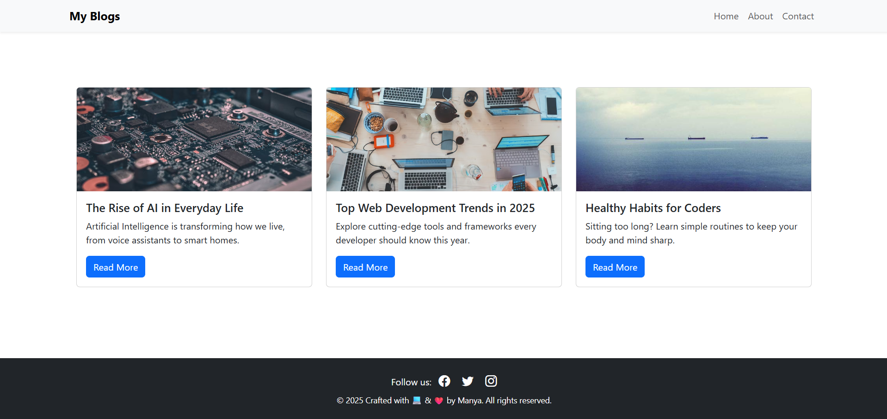

# task-8
This project is a responsive blog layout built using **Bootstrap 5** along with a custom `style.css` file. It features a collapsible navigation bar, responsive blog post cards, and a full-width footer. The layout adapts smoothly to different screen sizes such as mobile, tablet, and desktop.

## Features added

- Responsive **navbar** with toggle menu on small screens
- Three **blog post cards** using Bootstrap grid system
- **Footer** with social media icons and proper spacing
- Customized spacing, font styles, and layout using `style.css`
- Mobile-first and fully responsive design

## Tools Used

- HTML5
- CSS3 (`style.css`)
- Bootstrap 5 CDN
- Bootstrap Icons CDN

## 🎨 Bootstrap Utilities Used

- `container`, `row`, `col-md-4`
- `bg-dark`, `text-white`, `text-center`, `btn`, `shadow`
- `py-4`, `mb-0`, `me-3`, `w-100`, `fs-5`
- `navbar`, `card`, `collapse`, and more

## Files Included

- `index.html` – Main blog layout using Bootstrap 5
- `style.css` – Custom CSS for additional styling
- `README.md` – Project documentation

## How to Test Responsiveness

1. Open `index.html` in your browser.
2. Right-click → **Inspect** → Click the **device toolbar** (📱 icon).
3. Choose devices like `iPhone`, `iPad`, or resize manually.
4. Confirm that:
   - Navbar collapses to toggle icon
   - Blog cards stack correctly
   - Footer stays full-width with margin above

## Screenshot

